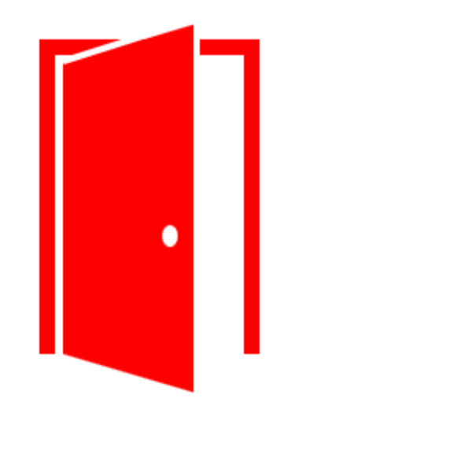
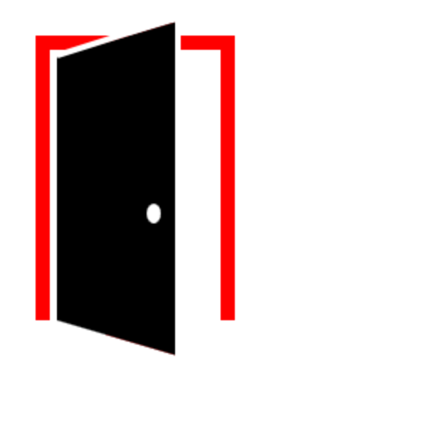
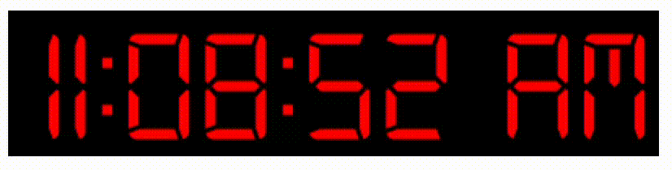
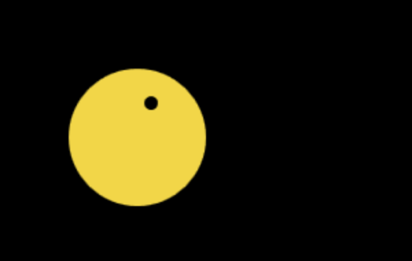
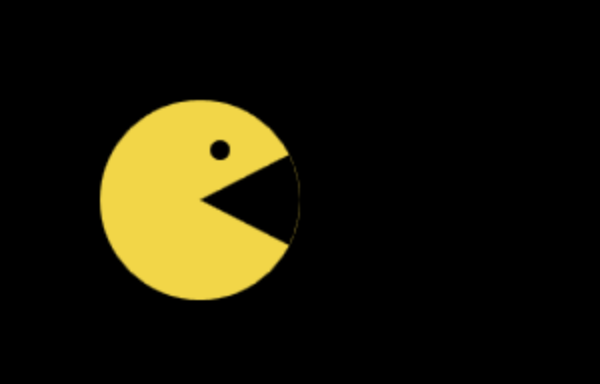
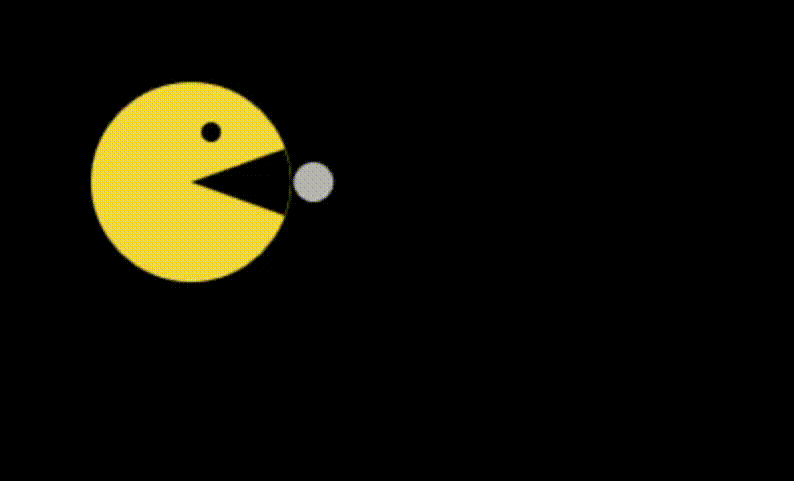

# Laborator 11 - Node.js & canvas/svg

#  Node.js

*Downloadați și instalați Node.js urmărind instrucțiunile de [aici](https://nodejs.org/en/download/).
Apoi folosiți notele de curs ca să vă amintiți conceptele de bază de Node.js și Express.js din [cursul 11](https://cs.unibuc.ro/~cechirita/tw/c11) și rezolvați următoarele exerciții pentru a realiza un modul de login/logout folosind sesiuni.*  

1.  Creați o pagină html/ejs `pagini/log.ejs` precum cea din [capitolul despre sesiuni din curs](https://cs.unibuc.ro/~cechirita/tw/c11/#/90) care conține un formular de login. 

2. Adăugați apoi în `app.js` codul ejs corespunzător pentru [login](https://cs.unibuc.ro/~cechirita/tw/c11/#/91) și [logout](https://cs.unibuc.ro/~cechirita/tw/c11/#/93). *Hint: Nu uitați să porniți serverul http.*

Începeți prin a crea o sesiune pentru client. Pentru verificarea datelor de login trebuie să definiți funcția `verifica` ce primește ca argumente două stringuri corespunzând ursername-ului și parolei. Pentru compararea datelor folosiți un fișier JSON `users.json` în care adăugați valori pentru numele utilizatorilor (`username`) și parolele lor (`parola`). 

După login, faceți un redirect către o pagină `logout.ejs` care conține mesajul 'Hello, username!' și un buton pentru logout. Nu uitați să modificați sesiunea în mod corespunzător la logout.

# canvas + svg

*Folosiți notele de curs ca să vă amintiți conceptele de bază pentru crearea de grafică 2D folosind canvas și svg din [cursul 12](https://cs.unibuc.ro/~cechirita/tw/c12) și rezolvați următoarele exerciții.*  

## [I see a red door and I want to paint it black](https://www.youtube.com/watch?v=O4irXQhgMqg)

3. Descărcați fișierul `door.zip` din directorul `resources`. Modificați fișierul JavaScript pentru a desena, folosind Canvas, o ușă precum cea din imaginea de mai jos.

4. Modificați `door.js` astfel încât la apăsarea pe ușă, aceasta să fie colorată negru.

5. (extra) Închideți ușa: adăugați în `door.js` cod JavaScript astfel încât la apăsarea pe ușă să pornească o animație de închidere a ușii. 

## the time is now!

6. Revedeți [exemplul](https://cs.unibuc.ro/~cechirita/tw/c12/#/38) Canvas din curs. Descărcați apoi fișierul `clock.zip` din directorul `resources`. Pornind de la exemplul din curs, modificați fișierul `clock.js` pentru a crea o animație a unui ceas digital precum cea de mai jos.

## extra: Pac-Man

Descărcați fișierul `pacman.zip` din directorul `resources`. Sarcina voastră este să modificați fișierul JavaScript pentru a-l anima pe Pac-Man folosind Canvas. Folosiți [exemplul acesta](https://css-tricks.com/pac-man-in-css/), scris în HTML+CSS, pentru a vă inspira. 

7. Desenați-l mai întâi pe Pac-Man: desenați un disc galben și un disc mic negru (ochiul).

8. Adăugați-i gură lui Pac-Man desenând un sector de cerc negru.

9. Animați deschiderea și închiderea gurii. *Hint: va trebui să vă folosiți de timestap (diferența între timpul la care a început animația și timpul curent).* Adăugați apoi un disc mic alb care își schimbă poziția și opacitatea pentru a-l hrăni pe Pac-Man. *Hint: puteți folosi culori în formatul rgba pentru a controla transparența*.

10. [Jucați-vă Pac-Man](https://codepen.io/hellokatili/pen/xwKRmo)! Și citiți cu atenție codul jocului. Înțelegeți ce face fiecare linie de cod? 

